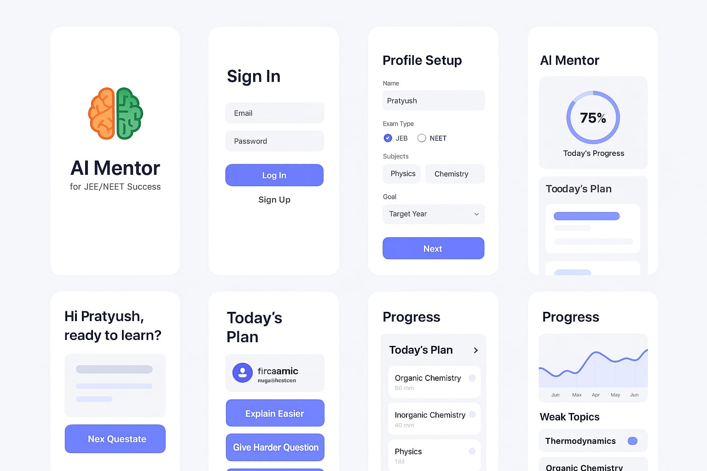

# 🎓 AI Mentor

> An AI-powered personalized learning companion that adapts to your study needs, tracks your progress, and helps you master any subject through smart quizzes and tailored study plans.



---

## ✨ Features

- **Smart Authentication** — Secure JWT-based sign-up and login with bcrypt password hashing
- **Profile Setup** — Personalize your learning profile on first login
- **AI-Driven Dashboard** — View today's study plan, progress charts, weak topics, and study streaks
- **Adaptive Quiz Engine** — Fetch questions from a live API; adjust difficulty (easier / harder) on the fly
- **Progress Visualization** — Segmented progress circles and graphs broken down by subject
- **Result Analysis** — Detailed post-quiz results with performance insights
- **Responsive UI** — Mobile-first design built with Tailwind CSS and Material UI

---

## 🛠️ Tech Stack

| Layer | Technology |
|---|---|
| Frontend | React 19, Vite, React Router DOM v7 |
| Styling | Tailwind CSS v4, Material UI (MUI) v7 |
| Auth Backend | Node.js, Express, JWT, bcrypt |
| Quiz API | MockAPI (REST) |
| Deployment | Frontend — Vite build; Backend — Render |

---

## 📁 Project Structure

```
AI_MENTOR/
├── src/
│   ├── pages/          # Route-level page components
│   │   ├── Landing.jsx
│   │   ├── Splash.jsx
│   │   ├── SignIn.jsx
│   │   ├── SignUp.jsx
│   │   ├── ProfileSetup.jsx
│   │   ├── Dashboard.jsx
│   │   ├── Quiz.jsx
│   │   └── Result.jsx
│   ├── components/     # Reusable UI components
│   │   ├── Navbar.jsx
│   │   ├── PlanCard.jsx
│   │   ├── ProgressCircle.jsx
│   │   ├── ProgressGraph.jsx
│   │   └── SegmentedProgressCircle.jsx
│   ├── services/       # API layer
│   │   ├── auth.js     # Signup / Login / GetMe helpers
│   │   └── quizservice.js
│   ├── router.jsx      # App routing
│   ├── App.jsx
│   └── main.jsx
├── auth-backend/
│   ├── server.js       # Express auth server (JWT)
│   └── package.json
├── public/
├── index.html
├── vite.config.js
└── package.json
```

---

## 🚀 Getting Started

### Prerequisites

- **Node.js** ≥ 18
- **npm** ≥ 9

### 1. Clone the Repository

```bash
git clone https://github.com/prat-glitch/AI_MENTOR.git
cd AI_MENTOR
```

### 2. Install Frontend Dependencies

```bash
npm install
```

### 3. Install Backend Dependencies

```bash
cd auth-backend
npm install
cd ..
```

### 4. Environment Variables

Create a `.env` file in the root (already git-ignored):

```env
JWT_SECRET=your_super_secret_key
```

### 5. Run the Auth Backend

```bash
cd auth-backend
node server.js
# Server starts on http://localhost:5000
```

### 6. Run the Frontend (Dev Server)

```bash
npm run dev
# App available at http://localhost:5173
```

---

## 📜 Available Scripts

| Command | Description |
|---|---|
| `npm run dev` | Start Vite dev server with HMR |
| `npm run build` | Production build to `dist/` |
| `npm run preview` | Serve the production build locally |
| `npm run lint` | Run ESLint checks |

---

## 🌐 API Reference

### Auth Backend (`https://ai-mentor-b7hg.onrender.com`)

| Method | Endpoint | Description |
|---|---|---|
| `POST` | `/signup` | Register a new user, returns JWT |
| `POST` | `/login` | Authenticate user, returns JWT |
| `GET` | `/me` | Get current user (requires `Authorization: Bearer <token>`) |

### Quiz API (MockAPI)

| Method | Endpoint | Description |
|---|---|---|
| `GET` | `/mentor/api/questions` | Fetch all quiz questions |

---

## 🤝 Contributing

1. Fork the repo
2. Create a feature branch: `git checkout -b feature/your-feature`
3. Commit your changes: `git commit -m "feat: add your feature"`
4. Push to the branch: `git push origin feature/your-feature`
5. Open a Pull Request

---

## 📄 License

This project is open source. See [LICENSE](LICENSE) for details.
