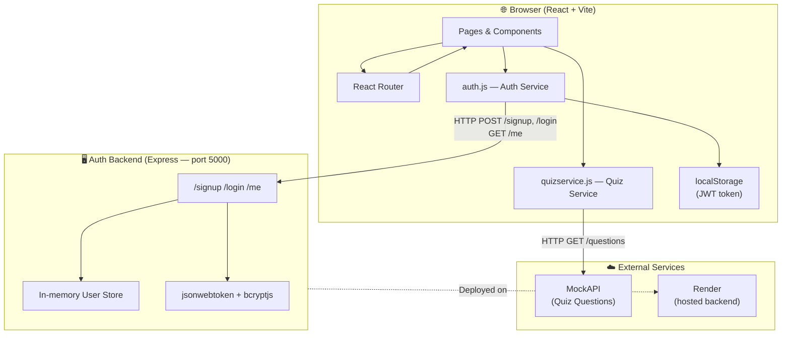
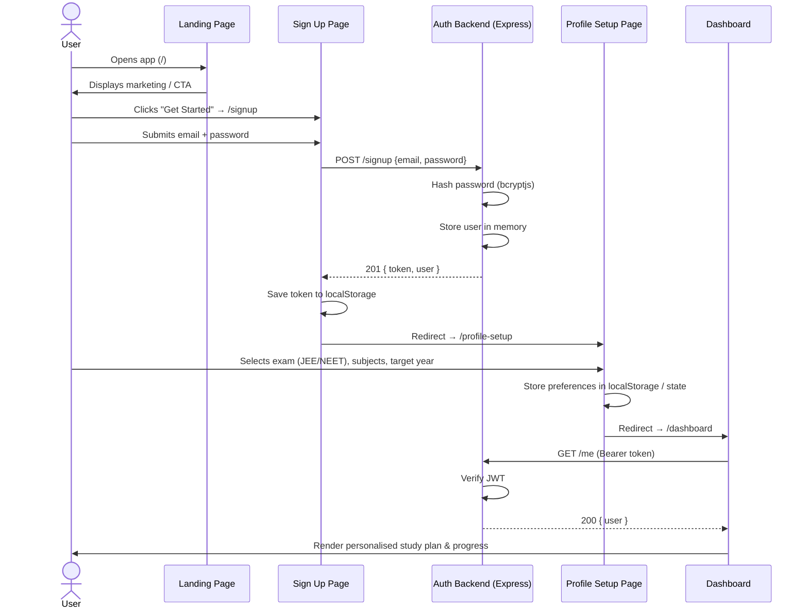
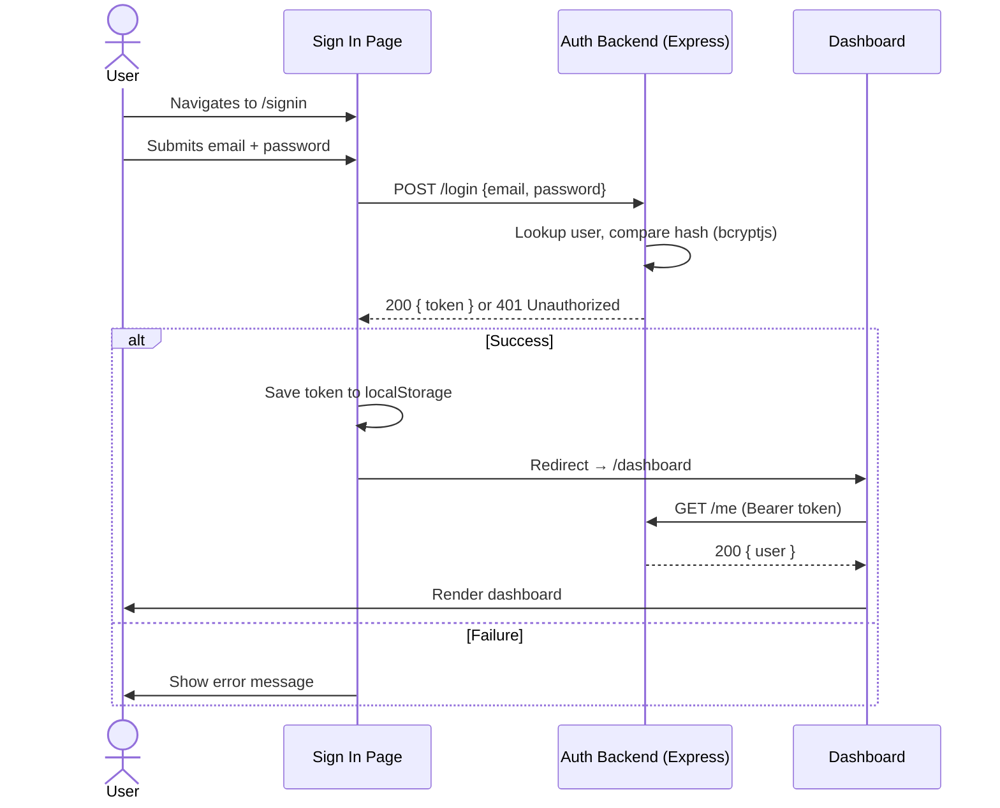
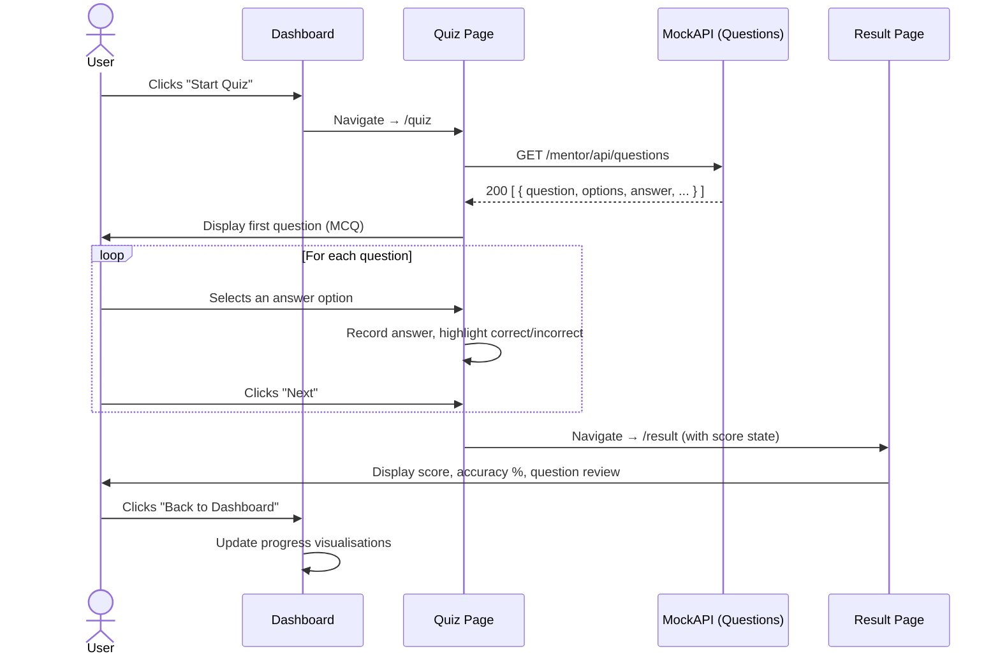
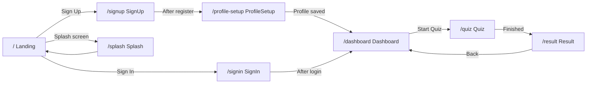
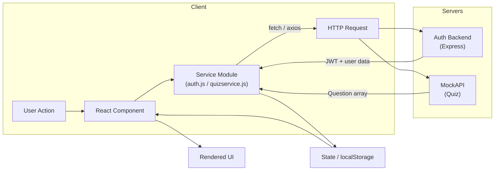

# 🗺️ AI Mentor — Visual Workflow

This document describes how the AI Mentor system works using architecture and sequence diagrams.

---

## 1. High-Level Architecture

The application consists of three runtime layers: the React frontend, the Express auth backend, and two external services (MockAPI for quiz data and the browser's `localStorage` for token persistence).

**Key points:**
- The frontend and backend are decoupled; the frontend calls the REST API over HTTP.
- The JWT token is stored in `localStorage` and sent as a `Bearer` header on protected requests.
- Quiz questions are sourced directly from MockAPI — no quiz data passes through the auth backend.
- The backend currently uses in-memory storage (resets on restart); a database can be substituted without changing the API contract.

---

## 2. User Registration & Profile Setup Flow

This sequence covers a brand-new user from landing on the app to reaching their dashboard for the first time.

---

## 3. Returning User Sign-In Flow

---

## 4. Quiz Session Flow

This sequence describes a complete quiz session from dashboard to results.

---

## 5. Component & Page Routing Map

**Route protection:** The `Navbar` component reads the JWT from `localStorage` and conditionally renders sign-in / sign-out controls. Routes like `/dashboard` and `/quiz` redirect unauthenticated users to `/signin`.

---

## 6. Data Flow Summary

---

> These diagrams are rendered by GitHub's built-in Mermaid support. You can also paste them into [mermaid.live](https://mermaid.live) for an interactive preview.
