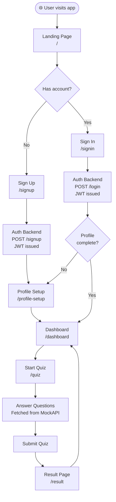
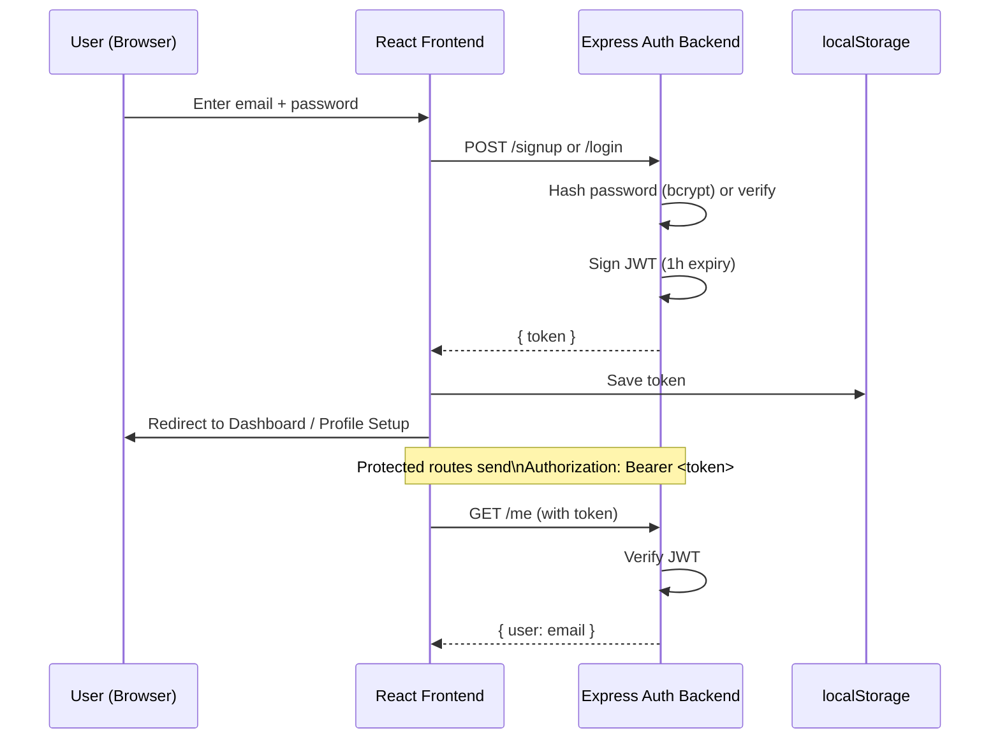
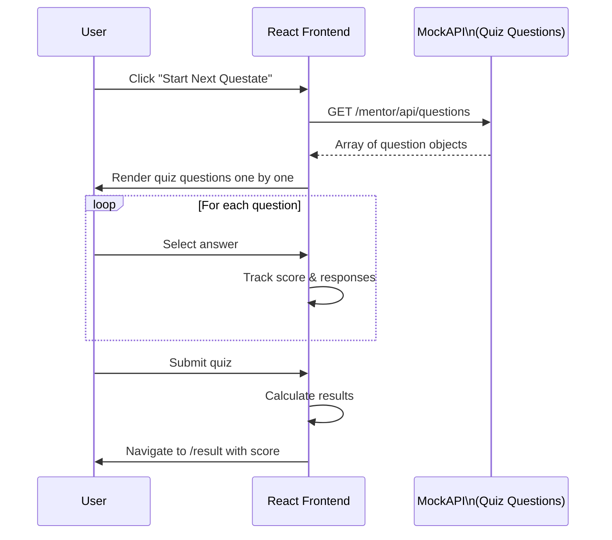
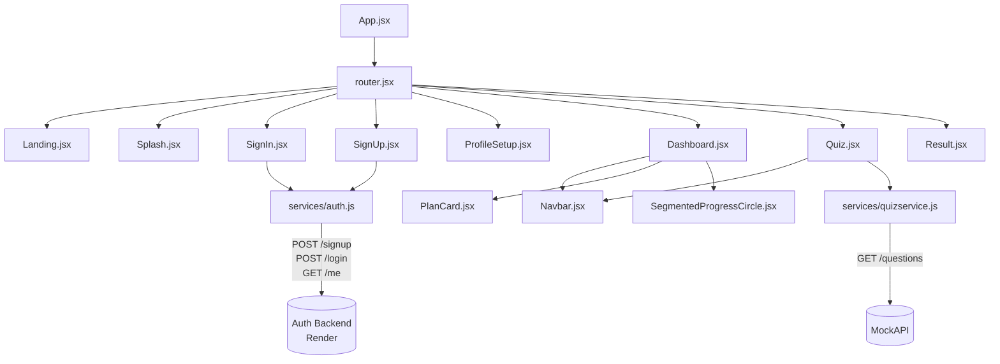
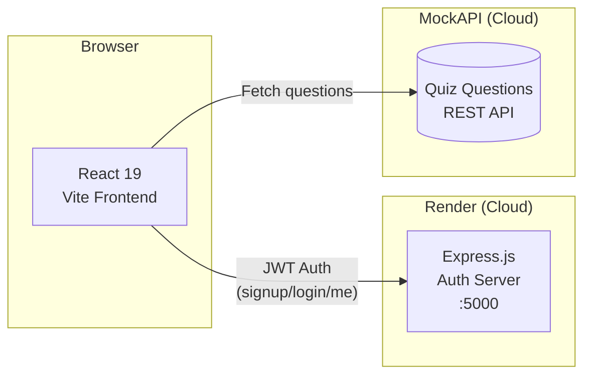
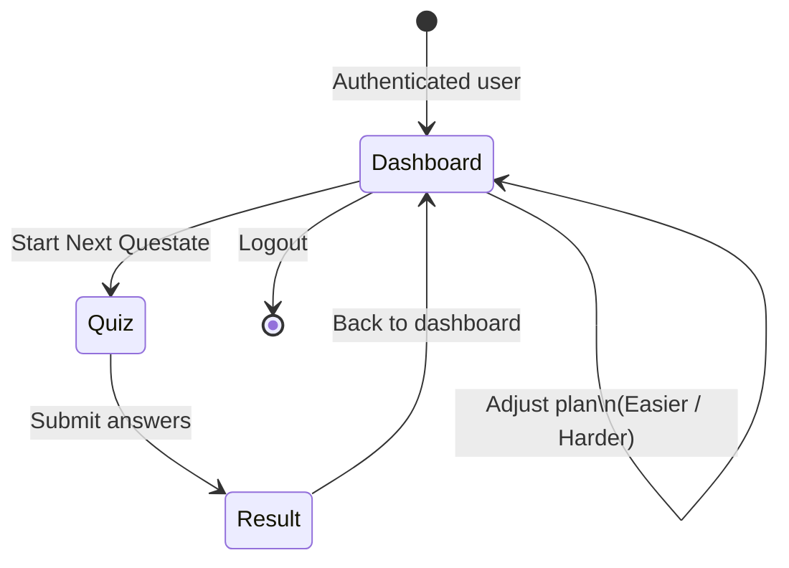

# 🗺️ AI Mentor — Visual Workflow

This document describes the complete user journey and system architecture of AI Mentor using visual diagrams.

---

## 1. User Journey (Page Flow)

---

## 2. Authentication Flow

---

## 3. Quiz Flow

---

## 4. Component Architecture

---

## 5. High-Level System Architecture

---

## 6. Dashboard State Overview

---

## 7. Route Map

| Route | Component | Auth Required |
|---|---|---|
| `/` | `Landing.jsx` | No |
| `/signup` | `SignUp.jsx` | No |
| `/signin` | `SignIn.jsx` | No |
| `/profile-setup` | `ProfileSetup.jsx` | Yes |
| `/dashboard` | `Dashboard.jsx` | Yes |
| `/quiz` | `Quiz.jsx` | Yes |
| `/result` | `Result.jsx` | Yes |
